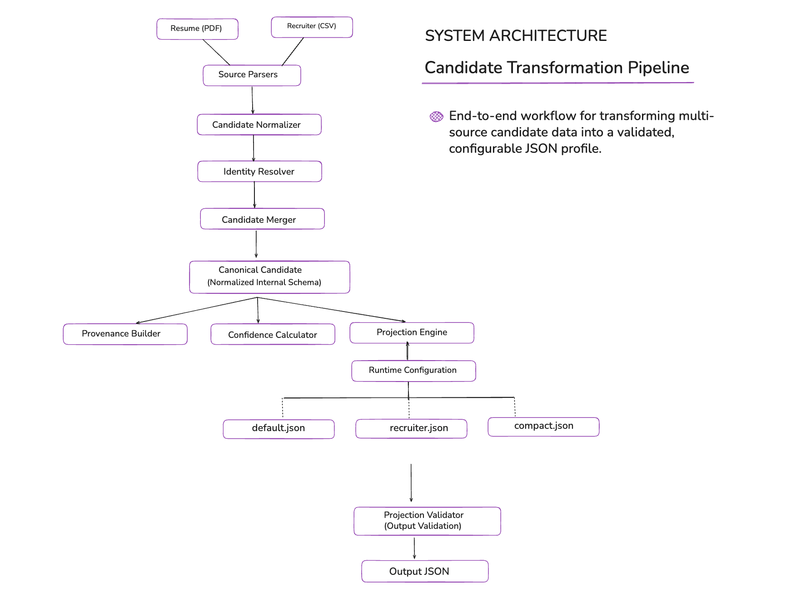

# Eightfold AI – Candidate Transformation Pipeline

A configurable Candidate Transformation Pipeline that ingests candidate information from multiple sources, resolves identity, merges records into a canonical profile, tracks provenance and confidence, and generates configurable JSON outputs through runtime projection.

---

## Overview

This project was developed as part of the Eightfold AI Engineering Assignment.

The pipeline transforms candidate information from multiple sources into a unified canonical candidate profile while ensuring deterministic processing, explainability, configurable output generation, provenance tracking, and schema validation.

---

## Architecture

<p align="center">
    
</p>

The pipeline consists of the following stages:

1. Resume PDF Parsing
2. Recruiter CSV Parsing
3. Candidate Normalization
4. Identity Resolution
5. Candidate Merge
6. Provenance Generation
7. Confidence Calculation
8. Runtime Projection
9. Output Validation

---

## Features

- Resume PDF Parsing
- Recruiter CSV Parsing
- Canonical Candidate Schema
- Candidate Normalization
- Identity Resolution
- Conflict-Aware Candidate Merge
- Provenance Tracking
- Confidence Scoring
- Runtime Configurable Output
- Projection Validation
- Modular Architecture

---

## Project Structure

```text
candidate-transformer/
│
├── app.py
├── input/
├── output/
├── src/
│   ├── parsers/
│   ├── normalizers/
│   ├── merger/
│   ├── confidence/
│   ├── projection/
│   └── validation/
│
├── tests/
├── docs/
├── requirements.txt
└── README.md
```

---

## Installation

```bash
git clone https://github.com/mohammadazaruddinshaik/Eightfold-AI-Candidate-Transformation-Pipeline.git

cd Eightfold-AI-Candidate-Transformation-Pipeline
```

Create a virtual environment.

### Windows

```bash
python -m venv .venv

.venv\Scripts\activate
```

### macOS / Linux

```bash
python3 -m venv .venv

source .venv/bin/activate
```

Install dependencies.

```bash
pip install -r requirements.txt
```

---

## Running the Pipeline

Default execution

```bash
python app.py
```

Verbose execution

```bash
python app.py --verbose --pretty
```

Recruiter Projection

```bash
python app.py \
    --config src/projection/sample_configs/recruiter.json
```

Compact Projection

```bash
python app.py \
    --config src/projection/sample_configs/compact.json
```

---

## Runtime Configuration

The output schema is controlled through JSON configuration files without modifying application code.

Supported configurations include:

- Default Canonical Profile
- Recruiter View
- Compact Profile

---

## Validation

Every projected output is validated before export.

Validation includes:

- Required Fields
- Data Types
- Email Format
- Phone Format (E.164)
- Date Format
- Country Format
- Skill Schema
- Confidence Range

---

## Testing

The implementation has been tested with the following scenarios:

- Happy Path
- Missing Company Information
- Email Normalization
- Phone Normalization
- Identity Resolution
- Candidate Merge
- Runtime Projection
- Missing Field Handling

Run the complete integration test suite:

```bash
python tests/test_pipeline.py
```

---

## Technical Design

The repository includes the complete technical design document describing:

- System Architecture
- Canonical Schema
- Merge Policy
- Runtime Output Configuration
- Edge Cases
- Design Decisions

Document:

```
docs/Candidate_Transformation_Technical_Design.pdf
```

---

## Demonstration

A short walkthrough demonstrating the implementation is included.

The demonstration covers:

- Technical Architecture
- Project Structure
- Pipeline Execution
- Runtime Configuration
- Output Validation
- Integration Test Execution

Video:
https://github.com/user-attachments/assets/0c01c46d-dbd3-4719-948a-afa407f78993

---

## Future Improvements

- OCR support for scanned resumes
- Multi-column resume parsing
- LinkedIn and GitHub enrichment
- Semantic resume understanding
- Additional candidate data sources

---

## Author

Shaik Mohammad Azaruddin

GitHub:
https://github.com/mohammadazaruddinshaik

LinkedIn:
https://linkedin.com/in/mohammadazaruddinshaik
